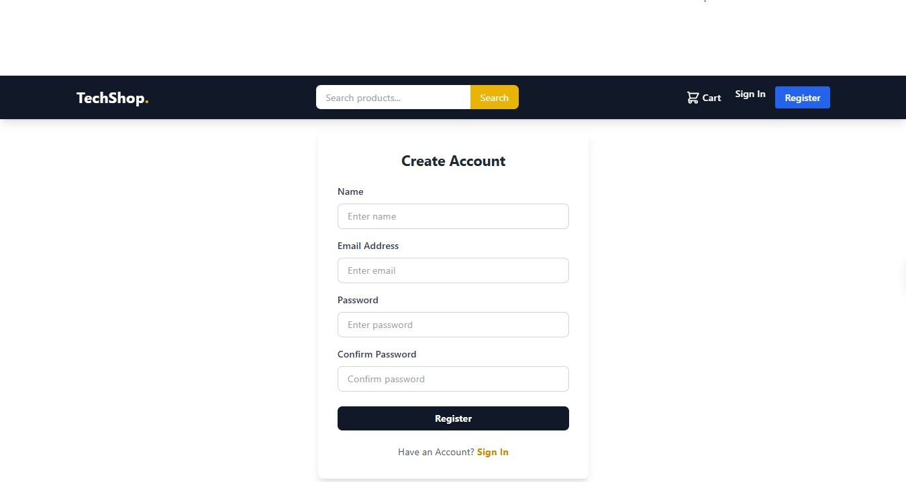
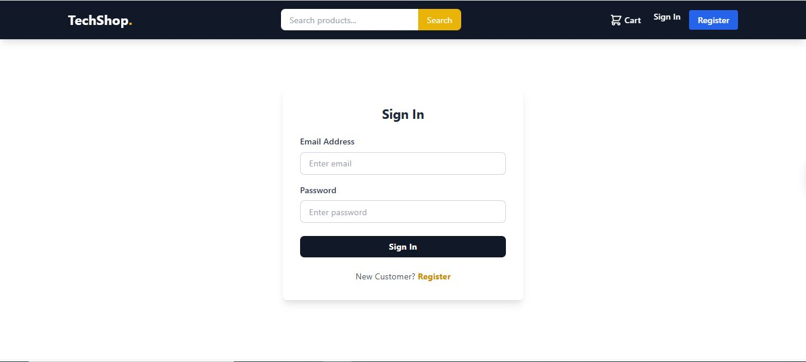
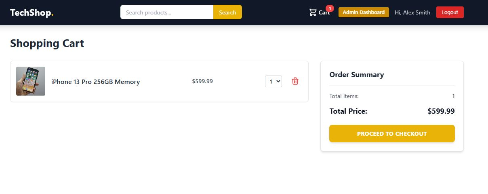
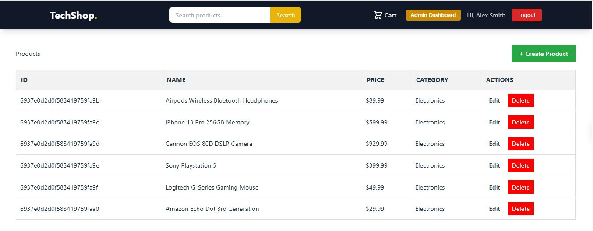
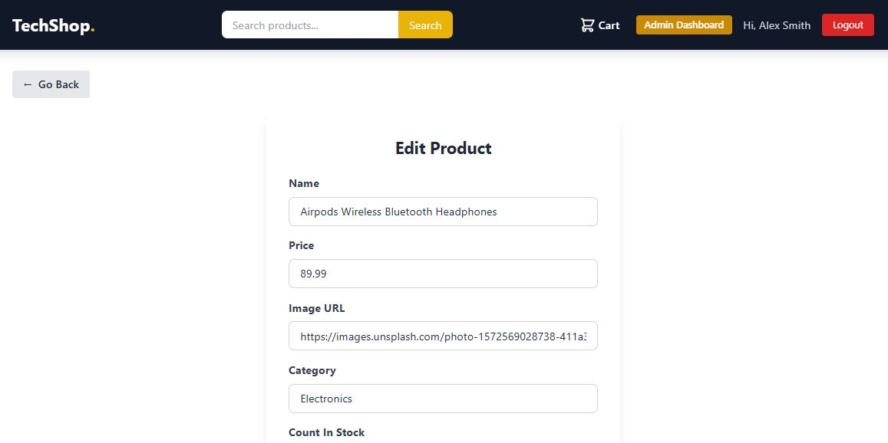
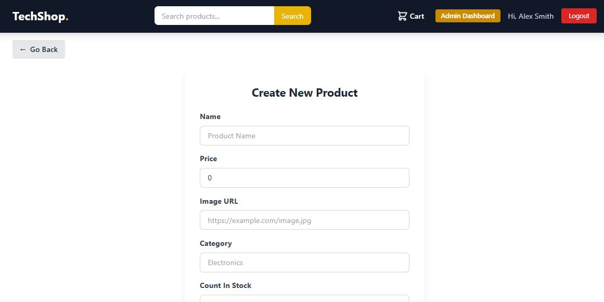
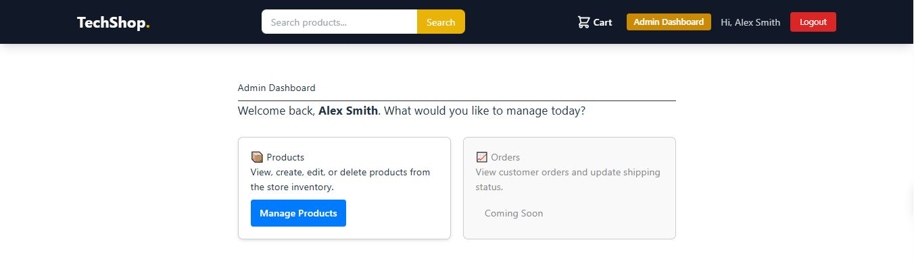

# TechShop - Full Stack MERN E-Commerce

A fully functional e-commerce platform built from scratch using the MERN stack (MongoDB, Express, React, Node.js). features include JWT authentication, PayPal/Credit Card payment integration, product search, and a comprehensive Admin Dashboard.


## 🚀 Features

- **Full Stack Architecture:** React frontend + Node/Express backend.
- **Modern UI:** Responsive design using Tailwind CSS.
- **Authentication:** Custom JWT Auth with HttpOnly cookies.
- **Admin Dashboard:** Product Management (CRUD), User Management, Order Management.
- **Shopping Cart:** Global state management using React Context API.
- **Search:** Backend Regex search functionality.

## 🛠️ Tech Stack

- **Frontend:** React, Tailwind CSS, Vite, Axios, Context API.
- **Backend:** Node.js, Express.js.
- **Database:** MongoDB (Mongoose).
- **Security:** BCrypt, JSON Web Tokens (JWT).

## 💻 How to Run Locally

1. **Clone the repo**
   ```bash
   git clone [https://github.com/dinuw2002/Ecommerce_app](https://github.com/dinuw2002/Ecommerce_app)

2. **Install Dependencies**
    
    # Install server dependencies
        cd server
        npm install

    # Install client dependencies
        cd ../client
        npm install

3. **Environment Setup Create a .env file in the server folder:**

        PORT=5000
        MONGO_URI=your_mongodb_connection_string
        JWT_SECRET=your_secret_key

4. **Run the App Open two terminals:**

        Terminal 1 (Backend): cd server then npm run dev
        Terminal 2 (Frontend): cd client then npm run dev

## 📷 Screenshots

### Register page


### SignIn page


### Home Page


### Product Details


### Search Bar


### Shopping Cart


### AdminProductManager


### Edit Product


### Create Product


### Admin Dashboard
